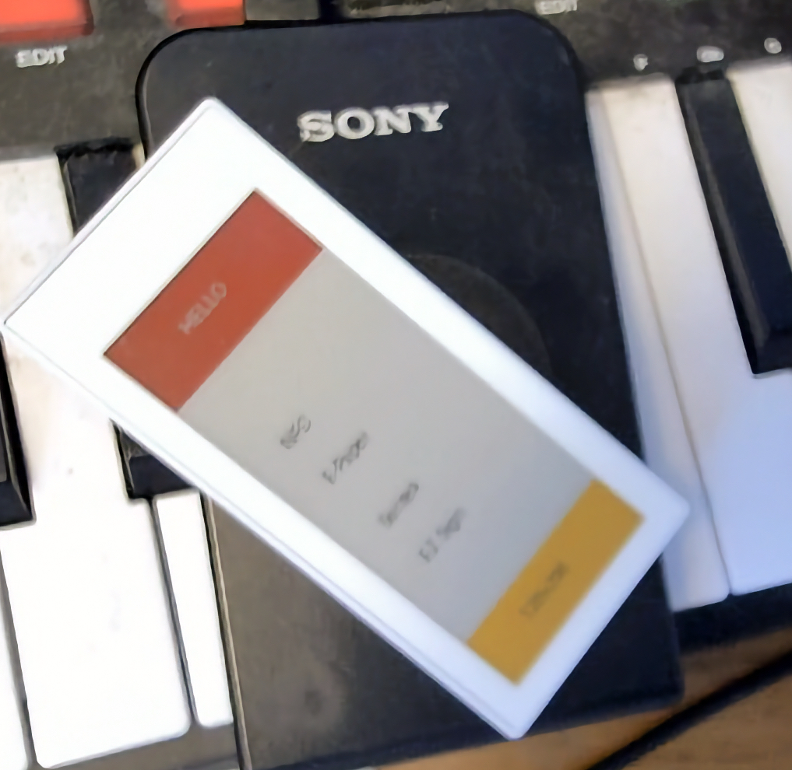

# NFC E-Paper Image Uploader

This is a command-line tool for uploading images to a Santek EZ Sign 2.9" 4-color NFC E-Paper display.

## Description

The tool takes an image file as input, converts it to the appropriate format for the E-Paper display, and sends it over NFC. It supports dithering, resizing, and setting a background color.

This project is built with C++17 and uses CMake for building.

## Requirements

- C++17 compiler
- CMake (>= 3.16)
- PkgConfig
- libusb (>= 1.0)
- lzo2

On macOS, you can install the dependencies using Homebrew:
```sh
brew install cmake pkg-config libusb lzo2
```

## Building

1.  Create a build directory:
    ```sh
    mkdir build
    ```
2.  Navigate to the build directory:
    ```sh
    cd build
    ```
3.  Run CMake and make:
    ```sh
    cmake ..
    make
    ```
The executable `send_epaper` will be created in the `build` directory.

## Test Environment

This project has been tested on the following environment:
-   **OS**: macOS
-   **Dependencies**: Installed via Homebrew
-   **NFC Reader/Writer**: Sony RC-S380

## Usage

```
Usage: ./send_epaper <image_path> [options]
       ./send_epaper --clear
       ./send_epaper --info
```

### Options

-   `--bg <black|white>`: Background color (default: black)
-   `--dither <atkinson|none>`: Dithering algorithm (default: atkinson)
-   `--resize <fit|cover>`: Resize mode (default: fit)
-   `--clear`: Clear the screen to white
-   `--info`: Display device information
-   `--help`: Show this help message

## Example Image


