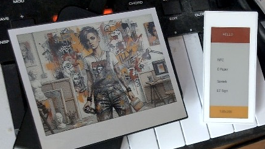

# NFC E-Paper Image Uploader

This is a command-line tool for uploading images to Santek EZ Sign NFC E-Paper displays.

## Supported Devices

### E-Paper Displays
- [ Santek ] EZ Sign 2.9" 4-color 128x296
- [ Santek ] EZ Sign 4.2" 4-color 400x300

### NFC Reader/Writers
- Sony RC-S380 (using libusb backend)
- ACS ACR122U (using libnfc backend) - Note: Referred to as ACR-112U in some contexts

## Description

The tool takes an image file as input, converts it to the appropriate format for the E-Paper display, and sends it over NFC. It supports dithering, resizing, and setting a background color.

This project is built with C++17 and uses CMake for building.

## Requirements

- C++17 compiler
- CMake (>= 3.16)
- PkgConfig
- libusb (>= 1.0) (for RC-S380 backend)
- libnfc (for PN532/ACR122U backend)
- lzo2

On macOS, you can install the dependencies using Homebrew:
```sh
brew install cmake pkg-config libusb libnfc lzo2
```

## Building

### RC-S380 (libusb) Backend (Default)

1.  Create a build directory:
    ```sh
    mkdir build
    cd build
    ```
2.  Run CMake and make:
    ```sh
    cmake ..
    make
    ```

### libnfc Backend (PN532, ACR122U, etc.)

1.  Create a build directory:
    ```sh
    mkdir build
    cd build
    ```
2.  Run CMake with `NFC_BACKEND_LIBNFC=ON`:
    ```sh
    cmake .. -DNFC_BACKEND_LIBNFC=ON
    make
    ```

The executable `send_epaper` will be created in the `build` directory.

## Test Environment

This project has been tested on the following environment:
-   **OS**: macOS
-   **Dependencies**: Installed via Homebrew
-   **NFC Reader/Writer**: Sony RC-S380

## Usage

```
Usage: ./send_epaper <image_path> [options]
       ./send_epaper --clear
       ./send_epaper --info
```

### Options

-   `--bg <black|white>`: Background color (default: black)
-   `--dither <atkinson|none>`: Dithering algorithm (default: atkinson)
-   `--resize <fit|cover>`: Resize mode (default: fit)
-   `--clear`: Clear the screen to white
-   `--info`: Display device information
-   `--help`: Show this help message


## Inspired from
- https://gist.github.com/niw/3885b22d502bb1e145984d41568f202d

## Example Image


